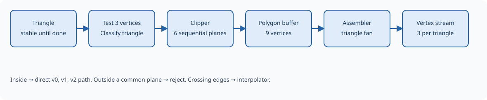

Clipping
========

Clipping retains the portion of a triangle inside the visible volume. It
happens before division by w, in homogeneous coordinates. The accepted
volume is ``−w ≤ x ≤ w``, ``−w ≤ y ≤ w``, and ``0 ≤ z ≤ w``. Points exactly
on a boundary count as inside. The near plane is at z=0 and the far plane
is at z=w.

   Fully visible triangles take a direct path; crossing triangles are clipped.

.. Editorial: This figure can be replaced by a schematic of the clipping stage.

Classifying the triangle
------------------------

The stage tests all three vertices against all six planes. Each vertex
receives a six-bit classification, with a set bit indicating that it is
outside the corresponding plane.

.. list-table:: Planes and inward distances
   :header-rows: 1
   :widths: 10 20 35 35

   * - Bit
     - Plane
     - Outside condition
     - Distance, positive inside
   * - 0
     - Left
     - x < −w
     - w + x
   * - 1
     - Right
     - x > w
     - w − x
   * - 2
     - Top
     - y > w
     - w − y
   * - 3
     - Bottom
     - y < −w
     - w + y
   * - 4
     - Far
     - z > w
     - w − z
   * - 5
     - Near
     - z < 0
     - z

When all three vertices are inside every plane, the original triangle
passes through unchanged. When all three are outside the same plane, the
whole triangle is rejected immediately. Other cases require clipping:
having vertices outside different planes does not by itself make a triangle
invisible.

This early classification avoids intersection calculations for triangles
whose outcome is already known.

Cutting the polygon
-------------------

The stage uses the Sutherland–Hodgman approach. It visits left, right, top,
bottom, far, and near in that order. At each plane it walks every edge of
the current polygon, including the closing edge from its last vertex back
to its first. The surviving polygon becomes the input to the next plane.

.. list-table:: Treatment of an edge A → B
   :header-rows: 1
   :widths: 25 25 50

   * - A
     - B
     - Vertices emitted
   * - Inside
     - Inside
     - B.
   * - Inside
     - Outside
     - Intersection.
   * - Outside
     - Inside
     - Intersection, then B.
   * - Outside
     - Outside
     - None.

Endpoints already on the plane are handled without duplicating them as
new intersections. If fewer than three vertices remain, there is no drawable
polygon and processing ends without output.

An internal polygon buffer holds up to nine vertices, the geometric maximum
for a triangle clipped by six half-planes. It is reused as the stage walks
the planes, and its final contents are passed to the triangle assembler.
The input triangle stays available until the complete operation finishes.

Intersections and attributes
----------------------------

For a crossing edge A → B, let dA and dB be its endpoints' signed distances
to the plane. The intersection parameter is
``t = |dA| / (|dA| + |dB|)``. Every attribute is interpolated with
``A + t × (B − A)``: position, texture coordinates, and all four color channels.
This gives new vertices suitable for the same downstream processing as the
original vertices.

The fraction uses 16 fractional bits and can represent both endpoints
exactly. An iterative divider calculates two fraction bits per cycle,
so the division itself takes eight advancing cycles for a general crossing.
Attributes are then calculated sequentially, sharing arithmetic resources
rather than duplicating a multiplier for every field. More intersections
therefore mean more processing time.

Inexact fractions are adjusted toward the inside endpoint. Position values
round to nearest with ties to even, while texture and color products are
truncated. The constrained position coordinate is also placed exactly on
the clipping plane, for example x=−w on left or z=w on far. This prevents
rounding from leaving the new vertex just outside the boundary.

Turning the polygon back into triangles
---------------------------------------

The surviving convex polygon is split into a fan:
``(v0, v1, v2)``, ``(v0, v2, v3)``, and so on. The assembler retains the
first vertex as a pivot and reuses the last vertex of the previous triangle.
A polygon with n vertices produces n−2 triangles, up to seven from a
nine-vertex polygon.

Each triangle is sent onward as a group of three vertices. The stage finishes
with the original input only after the whole fan has been emitted. If the
next stage cannot accept data, clipping and assembly pause with their
buffered polygon and current position preserved.

An invalid intersection or an incomplete polygon during assembly reports
a clipping error in ``GE_STATUS``. This error takes priority over a simultaneous
perspective error. It is a diagnostic condition, rather than the same
whole-triangle rejection mechanism used for division by zero. Immediate
outside-plane rejection and polygons that disappear during clipping also
have different counter behavior; see :doc:`registers`.
