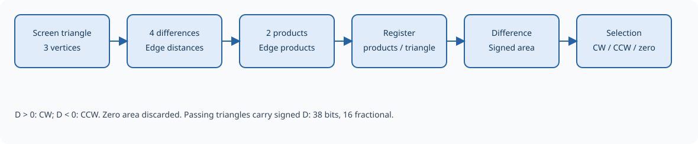

Culling
=======

Culling removes triangles according to their vertex orientation on the
screen. It can remove front faces, remove back faces, or retain both
orientations. Zero-area triangles are always discarded, even when face
culling is disabled.

   Signed area determines which triangles reach the packer and accompanies
   each retained triangle.

.. Editorial: This figure can be replaced by a schematic of the culling stage.

Signed area
-----------

With A, B, and C as the triangle's vertices in input order, the stage
computes twice the signed area:

.. math::

   D = (x_B-x_A)(y_C-y_A) - (y_B-y_A)(x_C-x_A)

Two products calculate the contributions of the triangle's edges, and their
difference gives the orientation. The products are held with the triangle
before the final face selection. A downstream pause preserves this pending
result.

Each retained triangle carries this same D value in its output record,
so downstream rasterization can compute its reciprocal without repeating
the determinant calculation. The area and vertices stay aligned when the
pipeline pauses; no extra pipeline stage is needed.

The stored area is signed, 38 bits wide, and has 16 fractional bits because
screen x and y each have 8 fractional bits. For the stored integer d,
:math:`D = d / 2^{16}` in square pixels. The value is twice the signed geometric
area, which is also the denominator used to normalize matching edge
functions into barycentric coordinates. Using pixel coordinates, the
reciprocal is therefore :math:`1/D = 2^{16}/d`. Edge functions evaluated in raw
fixed-point units must use a reciprocal with the matching scale. Reuse
requires the same screen coordinates, vertex order, and edge-function sign
convention; recomputing edges from rounded vertices can change D.

Only nonzero-area triangles are emitted. The sign is preserved for both
orientations, including when face culling is disabled. See :doc:`packer`
for the output field's bit positions.

With screen y increasing downward, positive D means CW (clockwise), negative
D means CCW (counterclockwise), and zero means a degenerate triangle. For
example, A=(0,0), B=(1,0), C=(0,1) gives positive D and is clockwise on the
screen. This convention accounts for the viewport's y-axis reversal.

Choosing faces
--------------

``GE_CTRL.front_face`` selects which winding counts as front-facing.
``GE_CTRL.cull_mode`` selects the class to remove.

.. list-table:: Passing conditions for a nondegenerate triangle
   :header-rows: 1
   :widths: 25 25 50

   * - ``front_face``
     - ``cull_mode``
     - Triangles retained
   * - CW
     - NONE
     - Both CW and CCW.
   * - CCW
     - NONE
     - Both CW and CCW.
   * - CW
     - FRONT
     - CCW, the back faces.
   * - CW
     - BACK
     - CW, the front faces.
   * - CCW
     - FRONT
     - CW, the back faces.
   * - CCW
     - BACK
     - CCW, the front faces.

Use only the defined cull-mode values: NONE, FRONT, and BACK. The reserved
encoding 3 removes every triangle. Both orientation-based removals and
zero-area triangles contribute to ``GE_TRI_DISCARDED``, once per processed
triangle even if the pipeline pauses before moving on.
