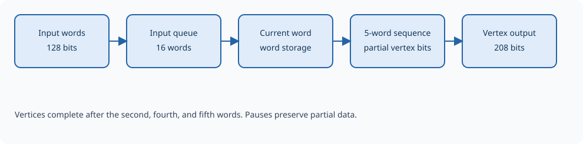

Input stage and unpacker
========================

The input stage turns 128-bit words into 208-bit vertices. An input FIFO
absorbs short differences in timing between the memory unit and the geometry
pipeline. The unpacker then joins the fields that cross word boundaries,
producing three vertices from every five words.

   The unpacker holds partial vertices until enough words have arrived.

.. Editorial: This figure can be replaced by a schematic of the input stage.

Why unpacking is needed
-----------------------

A vertex occupies 208 bits, so it does not fit into one 128-bit word.
The transfer format packs vertices together without aligning each one to
a word boundary. This keeps a complete triangle to five words, with only
16 padding bits. The exact field positions are given in :doc:`overview`.

.. list-table:: Reconstructing one triangle
   :header-rows: 1
   :widths: 20 55 25

   * - Input word
     - Use
     - Vertex completed
   * - First
     - Store the first 128 bits of the first vertex.
     - None.
   * - Second
     - Complete the first vertex and retain 48 bits of the second.
     - First.
   * - Third
     - Add another 128 bits to the second vertex.
     - None.
   * - Fourth
     - Complete the second vertex and retain 96 bits of the third.
     - Second.
   * - Fifth
     - Complete the third vertex and discard the 16 padding bits.
     - Third.

With words continuously available and no downstream pauses, three vertices
are produced per five word-consumption cycles, after the initial queue
read. Vertices keep their original order throughout the engine.

Buffering and pauses
--------------------

The standard input FIFO holds 16 words. One additional word can already
be held by the unpacker, along with partial vertex data. The reported input
word count covers the queue itself, so zero queued words does not necessarily
mean there is no input data left to process.

The producer must avoid exceeding the queue's capacity. A full queue can
accept a replacement word if a word is removed at the same time, but a
write without room is lost. Pipeline backpressure, STOP, or clearing enable
pauses consumption while preserving the current word and partial vertex.
Input writes remain possible if there is space.

START resumes from the saved position; it does not begin a new triangle
boundary. Soft reset instead abandons pending words and partial vertices,
so the next input must start with the first word of a new triangle.

There are no content-based boundary markers. A missing or extra word shifts
all later triangle boundaries. An interrupted transfer must resume in the
same order, or be discarded by resetting the datapath.
