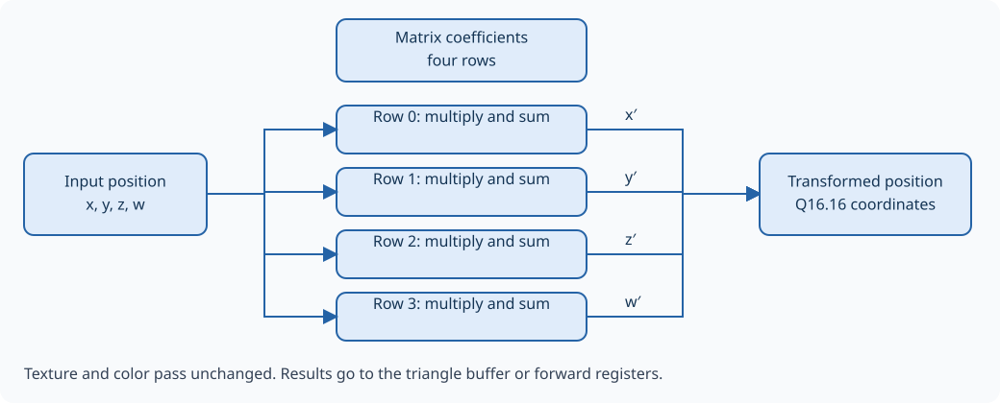

Matrix stage
============

The matrix stage transforms each vertex's homogeneous position. Software
supplies sixteen Q16.16 coefficients representing a 4 × 4 matrix. The stage
multiplies this matrix by the column vector (x, y, z, w). Texture coordinates
and color pass unchanged.

.. math::

   \begin{bmatrix}x'\\y'\\z'\\w'\end{bmatrix}
   = M \begin{bmatrix}x\\y\\z\\w\end{bmatrix}

   Each matrix row computes one output coordinate.

.. Editorial: This figure can be replaced by a schematic of the matrix stage.

Four coordinates in parallel
----------------------------

Each output coordinate is a dot product: four signed 25-bit F16 input
coordinates are multiplied by signed 32-bit F16 coefficients, then the
products are added. Products are 57 bits wide; the four-term sum is 59 bits.
All four rows operate in parallel. The transformed vertex is captured by
the following triangle buffer rather than moving through a sequence of
four coordinate calculations.

``GE_MTX_rc`` selects row r and column c, without transposition. The first
row produces x, the second y, the third z, and the fourth w. An identity
matrix has ``0x00010000`` on the diagonal and zero elsewhere. A matrix can
combine model, view, and projection transforms if software calculates the
combined coefficients first.

The arithmetic retains a signed 32-bit F16 result for each coordinate, so
transformed values can exceed the packed input range of [-256,256) without
additional input quantization. Product fractional bits are truncated rather
than rounded to nearest. Results are not saturated; software must keep them
within the matrix output range and the later pipeline stages must validate
values before narrowing them.

Assembling a triangle
---------------------

Clipping operates on complete triangles. A buffer therefore collects three
transformed vertices in their original order, then holds the triangle until
clipping has finished with it. While that triangle is being processed,
backpressure can pause the input stage. Once the buffer is released, it
can begin collecting the next triangle.

Matrix-forward mode
-------------------

With ``GE_CTRL.matrix_forward=1``, transformed vertices go to
``GE_MTX_RES_0..3`` instead of the triangle buffer. These registers expose
x, y, z, and w respectively. This mode is useful when only the matrix result
is needed: it bypasses clipping, perspective division, viewport conversion,
and culling for those vertices, and produces no output triangles.

Only the latest result is retained. There is no result queue or dedicated
forward-completion interrupt, and reading the four registers does not freeze
updates. Stop input consumption before reading if a coherent result from
one vertex is required.

Forward mode still follows START, enable, and pipeline backpressure.
Change modes only at a clean boundary; switching halfway through a triangle
does not discard vertices already collected for normal processing.
