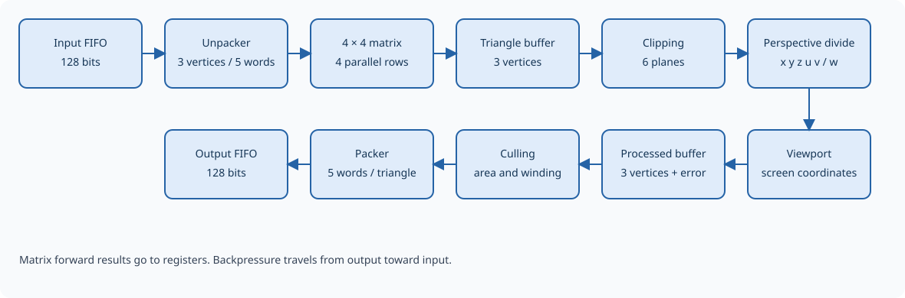

The GE and its pipeline
=======================

The Geometry Engine turns a stream of triangles into primitives expressed
in screen coordinates. Each input triangle consists of three vertices,
with a homogeneous position, texture coordinates, and a color. The engine
applies a 4 × 4 matrix, clips geometry to the visible volume, performs
perspective division, maps positions into the viewport, and removes triangles
that should not be drawn. It then serializes the remaining triangles into
128-bit words.

The matrix can represent a combined transformation, such as model, view,
and projection, provided software supplies the coefficients already combined.
Clipping can turn one input triangle into several output triangles. A
matrix-forward mode also allows software to read the result of the matrix
alone through registers, without sending those vertices through the rest
of the pipeline.

The GE prepares geometry for a later renderer. Rasterization, depth testing,
texture sampling, and shading belong to the stages that consume its output.
Input triangles carry all three vertices explicitly; there is no indexed
vertex format.

   The geometry pipeline and its input and output buffers.

.. Editorial: This figure can be replaced by a schematic of the pipeline stage.

How the stages work together
----------------------------

The unpacker reconstructs vertices from input words. The matrix transforms
one vertex at a time, and a triangle buffer gathers three transformed
vertices. Clipping needs the whole triangle, so this buffer retains it
until the visible polygon has been processed.

An entirely visible triangle passes through clipping unchanged. A partially
visible triangle is cut against the six boundaries of the viewing volume;
the resulting polygon is split into triangles. Perspective division and
the viewport then process the resulting stream of vertices. A second
triangle buffer assembles groups of three before culling. If a vertex has
a division error, this buffer removes the whole group so that incomplete
triangles cannot reach the output.

The culler evaluates orientation in screen coordinates. Surviving triangles
enter the packer, which produces five output words for each triangle.

Buffers let adjacent stages work at different rates. When a downstream
stage cannot accept more data, it holds up the stages that feed it. This
is called backpressure. Pending data stays in place until processing can
resume. There is no fixed latency for every triangle: clipping work and
the number of output triangles vary with the geometry, and a slow output
consumer can hold up the pipeline.

Memory and data transfers
-------------------------

The GE has a 32-bit register interface and separate input and output streams
of 128-bit words. An external memory unit supplies input words, removes
output words, and reports transfer completion. Buffer addresses are configured
through the GE registers for that unit to use. Address traversal, range
checking, and the convention for inclusive or exclusive end addresses belong
to the system's memory integration.

The standard configuration buffers 16 input words and 16 output words.
The input producer must respect the available capacity; an excess write
can be lost. Output reads return one queued word after a clock edge.
FIFO means first in, first out: words leave in the order they arrived.
Reported word counts describe the queued words, not every piece of data
already being assembled or processed elsewhere in the engine.

Numeric formats
---------------

Positions before the viewport use signed Q16.16: a 32-bit two's-complement
integer divided by 65536. For example, ``0x00010000`` represents 1 and
``0xFFFF0000`` represents −1. Matrix coefficients and texture coordinates
use the same signed format. The homogeneous coordinate w allows a single
matrix to express transformations including perspective projection; a
Cartesian point normally enters with w=1.

Color has four unsigned 4-bit channels, each ranging from 0 to 15. There
is no color-space conversion. Calculations have finite precision and do
not saturate automatically: out-of-range results can lose their high bits.
Choose transformations and screen dimensions that keep results representable.

.. list-table:: Data carried through the engine
   :header-rows: 1
   :widths: 30 15 55

   * - Data
     - Bits
     - Contents
   * - Input position
     - 128
     - Four Q16.16 coordinates: x, y, z, w.
   * - Texture coordinates
     - 64
     - Q16.16 u and v.
   * - Color
     - 16
     - Four 4-bit RGBA components.
   * - Input vertex
     - 208
     - Position, texture coordinates, and color.
   * - Input triangle
     - 624
     - Three input vertices.
   * - Reciprocal of w
     - 31
     - Unsigned 25-bit Q1.24 mantissa and signed 6-bit exponent.
   * - Processed position
     - 103
     - 24-bit x, y, z and the 31-bit reciprocal of w.
   * - Processed vertex
     - 183
     - Processed position, texture coordinates, and color.
   * - Processed triangle
     - 600
     - Three processed vertices (549 bits) and signed doubled screen area (51 bits).

The reciprocal represents ``(mantissa / 2^24) × 2^exponent``. After
perspective division, it replaces the original w coordinate. Output x and
y are Q16.8, while output depth z is Q8.16; see :doc:`viewport`.
The triangle's area has 16 fractional bits and is computed from these final
screen x and y coordinates; see :doc:`culling` and :doc:`packer`.

Input triangle format
---------------------

A triangle occupies five 128-bit words, or 80 bytes. The 624 useful bits
are followed by 16 padding bits at the high end of the last word. There
are no headers, indices, or end markers; boundaries are determined by
counting groups of five words.

Let T be the complete 640-bit transfer. Send bits 127:0 first, followed by
255:128, 383:256, 511:384, and 639:512. The first vertex occupies bits 207:0,
the second occupies 415:208, and the third occupies 623:416. The system's
memory interface defines how word lanes correspond to bytes in memory.

.. list-table:: Input vertex fields, relative to the vertex's least significant bit
   :header-rows: 1
   :widths: 25 25 50

   * - Bits
     - Field
     - Interpretation
   * - 3:0
     - a
     - Unsigned alpha.
   * - 7:4
     - b
     - Unsigned blue.
   * - 11:8
     - g
     - Unsigned green.
   * - 15:12
     - r
     - Unsigned red.
   * - 47:16
     - v
     - Q16.16 texture coordinate.
   * - 79:48
     - u
     - Q16.16 texture coordinate.
   * - 111:80
     - w
     - Q16.16 homogeneous coordinate.
   * - 143:112
     - z
     - Q16.16 coordinate.
   * - 175:144
     - y
     - Q16.16 coordinate.
   * - 207:176
     - x
     - Q16.16 coordinate.

From most to least significant, a vertex contains x, y, z, w, u, v, r,
g, b, and a. Input padding is ignored. The output format is described in
:doc:`packer`.

Starting, pausing, and finishing work
-------------------------------------

Hardware reset clears all configuration, including the matrix. Before
starting, load a useful matrix, viewport dimensions, buffer addresses,
and the desired control settings. Supply input words and issue START with
``enable=1``. Configuration is live rather than captured per job; change
it when no affected data is in flight.

STOP pauses input consumption. With the GE still enabled, triangles already
inside the pipeline continue to drain. START resumes consumption. STOP
takes priority if both commands are issued together. Clearing enable stops
the geometric pipeline, but input writes and output reads remain possible.
The packer can continue serializing triangles it already accepted.

SOFT_RESET flushes pending data, clears counters, forward results, and
pending interrupts, and stops consumption. It preserves configuration,
including enable and the interrupt mask. Hardware reset clears configuration
too.

BUSY describes the geometric pipeline, including incomplete vertex groups.
It excludes the input queue and data already handed to the packer. DONE
reflects transfer completion reported by the external memory unit; it does
not stop processing by itself. End-of-job handling must therefore also
account for buffered data and the memory unit's transfer protocol. See
:doc:`registers` for the precise status and counter meanings.
