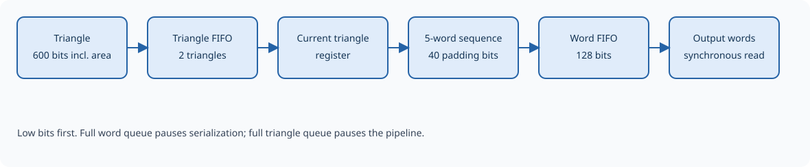

Packer and output
=================

The packer receives processed triangles and serializes each into four 128-bit words.
Each transfer is 64 bytes. Screen coordinates are signed, and w is replaced
by its encoded reciprocal. Each triangle carries its signed doubled screen
area for downstream rasterization.

Direct raster output
--------------------

With ``GE_CTRL.raster_forward=1``, surviving triangles are sent directly
from the culling output to ``raster_triangle_o``, a 512-bit ``proc_triangle_t``
containing all three processed vertices and the signed doubled screen area.
It has the same bits as the packed format below, without word serialization.

The raster engine accepts a complete triangle on each rising clock edge
where ``raster_valid_o=1``. There is no ready or stall input from the raster
engine; it must have capacity for every valid transfer, including transfers
on consecutive cycles. Data is meaningful only with valid asserted. Clearing
GE enable or asserting hardware/soft reset suppresses raster valid, so a
triangle held while the GE is disabled is not transferred repeatedly.
STOP pauses input consumption while in-flight triangles continue to drain.

In this mode the packer accepts no new triangles and its backpressure cannot
stall the geometry pipeline. With an initially empty packer, the output FIFO
therefore stays empty and no new output DDR writes are needed. Triangles and
words already accepted in memory mode remain buffered and may still serialize
or be read; selecting raster mode does not flush them. Soft reset flushes both
paths while preserving configuration.

The destination setting is live. Change it with no affected pipeline data in
flight, and drain pending memory output or use soft reset before switching
jobs if no earlier DDR output should remain. Clearing ``raster_forward``
restores packer acceptance and backpressure. ``GE_TRI_OUTPUT`` counts accepted
triangles in either mode; DONE and interrupts still use the existing external
completion input, with no automatic raster completion event.

   Memory mode uses two queues; direct raster mode bypasses them.

.. Editorial: This figure can be replaced by a schematic of the packer stage.

Buffering and backpressure
--------------------------

The packer has a queue of complete triangles, storage for the triangle
currently being serialized, and a queue of 128-bit output words. The standard
configuration holds two triangles in the first queue and 16 words in the
output queue.

This arrangement lets the geometry pipeline hand over a complete triangle
while the output interface transfers earlier words. The next triangle can
begin serialization immediately after the previous triangle's last word,
without a mandatory empty cycle between them.

If the word queue fills, serialization pauses at its current position.
The triangle queue can continue accepting data until it also fills; then
backpressure stops the geometric pipeline. Processing resumes as the
consumer makes room. Output word counts cover only serialized words in
the output queue, so a zero count does not guarantee that the packer is empty.

Processed binary format
-----------------------

A processed triangle contains exactly 512 bits: three 158-bit vertices and
a signed 38-bit area. It is sent as four words from least to most significant,
with no padding. In the complete transfer P:

* vertex A occupies bits 157:0;
* vertex B occupies bits 315:158;
* vertex C occupies bits 473:316;
* bits 511:474 contain the signed doubled screen area.

The area is a 38-bit two's complement value with 16 fractional bits. It
is the determinant computed from the transmitted screen x and y coordinates,
without rounding or taking its absolute value. Dividing the stored integer
by :math:`2^{16}` gives twice the signed geometric area in square pixels. See
:doc:`culling` for the formula and winding convention.

.. list-table:: Processed vertex fields, relative to the vertex's least significant bit
   :header-rows: 1
   :widths: 25 30 45

   * - Bits
     - Field
     - Interpretation
   * - 3:0
     - a
     - Unsigned alpha.
   * - 7:4
     - b
     - Unsigned blue.
   * - 11:8
     - g
     - Unsigned green.
   * - 15:12
     - r
     - Unsigned red.
   * - 47:16
     - v
     - Signed 32-bit v/w, F16.
   * - 79:48
     - u
     - Signed 32-bit u/w, F16.
   * - 85:80
     - w.exponent
     - Signed 6-bit exponent.
   * - 103:86
     - w.mantissa
     - Unsigned 18-bit Q1.17 mantissa.
   * - 120:104
     - z
     - Unsigned 17-bit Q1.16 z/w.
   * - 138:121
     - y
     - Signed 18-bit screen coordinate, F8.
   * - 157:139
     - x
     - Signed 19-bit screen coordinate, F8.

From most to least significant, a processed vertex contains x, y, z,
reciprocal mantissa, reciprocal exponent, u/w, v/w, r, g, b, and a. Its
width is 158 bits. The area follows the three vertices directly; the complete
512-bit record has no padding.

Reading output
--------------

A read from a nonempty queue removes one word and returns it after the
clock edge. A read from an empty queue produces no new word; the previous
output value can remain visible. The consumer must therefore track whether
a read was accepted, rather than treating any value on the interface as
new data.

Reset abandons buffered triangles and output words and restarts serialization
at the first word of a triangle. Output data is meaningful only after an
accepted read from the reset queue.
