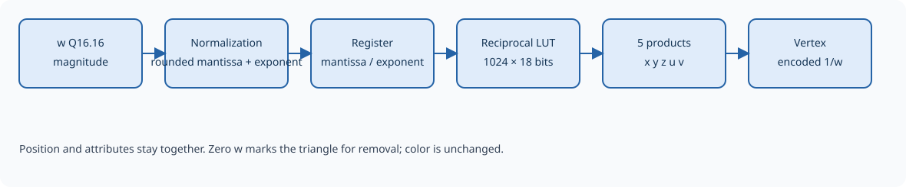

Perspective divide
==================

Perspective division converts homogeneous positions into normalized
coordinates. It computes x/w, y/w, and z/w for every vertex. It also prepares
u/w and v/w for perspective-correct texture interpolation in a later stage.
Color passes unchanged.

   One reciprocal calculation is shared by position and texture coordinates.

.. Editorial: This figure can be replaced by a schematic of the perspective stage.

A shared reciprocal
-------------------

Instead of dividing each attribute independently, the stage approximates
1/w once and multiplies x, y, z, u, and v by that value. First it separates
positive w into a mantissa between 1 and 2 and a power-of-two exponent.
Normalization lets a fixed-size lookup table cover a wide range of w values.

The table has 1024 entries containing 25-bit Q1.24 reciprocal mantissas.
The selected entry is used directly, without interpolation or a refinement
step. The result is therefore approximate, including for some simple values
such as w=1. This precision carries through to normalized positions and
texture coordinates.

The five products are returned as signed Q16.16 values, with truncation and
no saturation. The reciprocal is retained separately as a 25-bit unsigned
mantissa and a 6-bit signed exponent:

.. math::

   1/w \approx (\mathrm{mantissa}/2^{24}) \times 2^{\mathrm{exponent}}

The output vertex carries this reciprocal in place of the original w.
A later renderer can interpolate u/w, v/w, and 1/w, then recover texture
coordinates from their ratios.

Errors and triangle boundaries
------------------------------

The stage requires positive w. Negative-w points are outside the clipping
volume and are not supported by the reciprocal calculation. The reported
division error detects w=0; it is not a general validation of all invalid
or out-of-range inputs. A point with x=y=z=w=0 can pass the clipping tests
and still cause this error.

A failed division retains its place in the vertex stream, marked as an
error. Dropping that vertex immediately would shift the three-vertex
boundaries and corrupt subsequent triangles. After viewport conversion,
the triangle assembly buffer removes the complete group containing it.
No partial triangle is delivered to the culler.

``GE_STATUS`` reports the perspective error while the failed vertex is
being processed. A pending interrupt can retain the event after live status
returns to zero. These removed groups do not directly increment
``GE_TRI_DISCARDED``; see :doc:`registers` for counter coverage.

When the pipeline pauses, the current vertex, reciprocal, and error indication
are held together, preserving their alignment.
