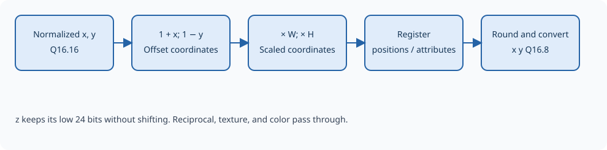

Viewport transform
==================

The viewport maps normalized x and y into screen coordinates. The origin
is at the top left: x increases to the right and y increases downward.
``GE_VP_WIDTH`` and ``GE_VP_HEIGHT`` hold unsigned integer pixel dimensions,
not Q16.16 values. There is no configurable viewport origin or depth-range
transformation.

.. math::

   x_s = \frac{1+x_{ndc}}{2} W, \qquad
   y_s = \frac{1-y_{ndc}}{2} H

   The viewport changes scale and reverses the y axis.

.. Editorial: This figure can be replaced by a schematic of the viewport stage.

Mapping to the screen
---------------------

The stage offsets normalized x and reverses normalized y, then scales each
by half the corresponding screen dimension. Results are stored in 24-bit
Q16.8, giving a resolution of 1/256 pixel. Conversion rounds to nearest,
with halfway cases toward the greater value. Values are not saturated and
overflow is not reported.

Ideally, normalized (0,0) maps to (W/2,H/2), (−1,+1) maps to (0,0), and
(+1,−1) maps to (W,H). The endpoint is W or H rather than W−1 or H−1;
pixel coverage and border rules belong to the later renderer. Approximate
perspective division can make actual coordinates differ slightly from these
ideal values.

The culler interprets screen x and y as signed 24-bit coordinates. Keep
screen dimensions and results within that signed Q16.8 range. The dimension
registers themselves do not enforce this limit.

Depth and other attributes
--------------------------

Depth z keeps 16 fractional bits and is stored in a 24-bit Q8.16 field.
It is the normalized z/w from perspective division, with no viewport depth
rescaling. For example, depth 1 is encoded as ``0x010000``. The different
fractional widths matter when decoding the output: x and y use eight
fractional bits, but z uses sixteen.

The encoded reciprocal of w passes through unchanged. Texture coordinates
remain 32-bit u/w and v/w values, and color remains four 4-bit channels.
Position and attributes are held together when the pipeline pauses.

Assembling complete screen-space triangles
------------------------------------------

A triangle buffer after the viewport collects each group of three vertices
in its original order. It passes complete, valid triangles to the culler.
If any vertex carries a perspective-division error, the whole group is
removed. This preserves triangle boundaries and prevents invalid geometry
from reaching the output.

This assembly buffer is separate from the output packer's triangle queue:
it bridges the vertex-oriented processing stages and the triangle-oriented
culling stage.
